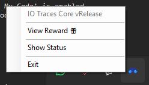

# Prolific Submission Guide


## Introduction

This page contains information about how to complete your submission on prolific. Make sure you have the tracer **installed** and **running** before you continue reading the following page.

We'll provide a code that you can submit to prolific to complete the experiment. The code will be provided to you after you have uploaded **_AT LEAST 1 trace file_**.

---

⚠️ **PLEASE NOTE** if you submit without using the submission code, we'll **MESSAGE** you to **RETURN** your submission.

If we didn't receive your response **WITHIN 24 HOURS**, we'll **REJECT** your submission.

---

## How to get your submission code

### Windows



1. Right click the tray icon of IO-Tracer.
2. Click "View Reward"

### Linux

It's pretty straightforward. You can check it using the following command.

```bash
sudo ./iotrc.py --reward
```
