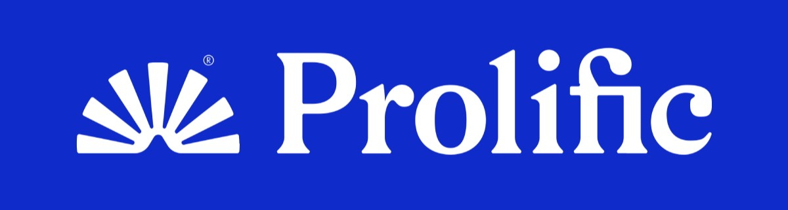
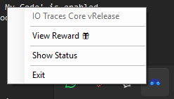
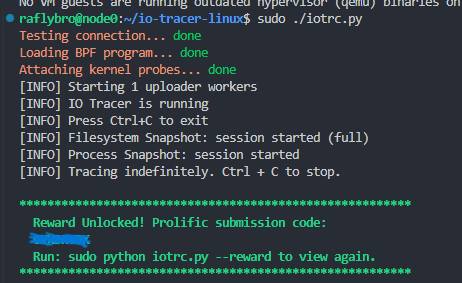

# Prolific Submission Guide



## Introduction

This page contains information about how to complete your submission on prolific. Make sure you have the tracer **installed** and **running** before you continue reading the following page.

We'll provide a code that you can submit to prolific to complete the experiment. The code will be provided to you after you have uploaded **_AT LEAST 1 trace file_**.

---

⚠️ **PLEASE NOTE** if you submit without using the submission code, we'll **MESSAGE** you to **RETURN** your submission.

If we didn't receive your response **WITHIN 24 HOURS**, we'll **REJECT** your submission.

---

## How to get your submission code

### Windows



1. Right click the tray icon of IO-Tracer.
2. Click "View Reward".
3. A dialogue will popup, displaying your Prolific submission code.

The program will notify you once you've passed the reward threshold, or you can check regularly by following the steps above.

### Linux

The Linux experience is straightforward: you'll be notified directly in the CLI once you're eligible.



If you happen to miss the notification, you can check your reward status anytime with:

```bash
sudo ./iotrc.py --reward
```