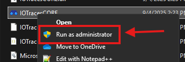
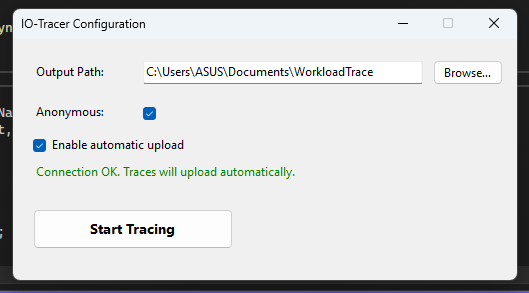

# Quick Start Guide

## Linux
### Prerequisites
- Linux system with kernel headers
- Python 3.x
- sudo privileges (required for BPF operations)
- BPF Compiler Collection / BCC

You can execute these commands for BCC installation:
```bash
# Debian
echo deb http://cloudfront.debian.net/debian sid main >> /etc/apt/sources.list
sudo apt-get install -y bpfcc-tools libbpfcc libbpfcc-dev linux-headers-$(uname -r)

# Ubuntu
sudo apt-get install bpfcc-tools linux-headers-$(uname -r)

# Fedora
sudo dnf install bcc

# Arch
pacman -S bcc bcc-tools python-bcc
```

For more distros, visit the official BCC's [installation guide](https://github.com/iovisor/bcc/blob/master/INSTALL.md)

### Basic Usages

Infinite tracing (Exit on demand)
```bash
sudo python3 iotrc.py 
```

Quick Start (30 Seconds Trace)
```bash
sudo python3 iotrc.py -d 30
```

### Command Options
#### Core options
- `-d, --duration <seconds>` - Duration to trace (default: indefinite)
- `-o, --output <directory>` - Output directory (default: auto-generated)
- `-v, --verbose` - Enable verbose logging
- `-a, --anonimize` - Anonymize process and file names 

#### Advance options
- `-b BPF_FILE, --bpf-file BPF_FILE` - BPF C source file path
-  `-p PAGE_CNT, --page-cnt PAGE_CNT` - Number of pages for perf buffer (default 8)
-  `-s SPLIT_THRESHOLD, --split_threshold SPLIT_THRESHOLD` - Split threshold in seconds (default 1 day)
-  `-a, --anonimize` - Enable anonymization of process and file names
- `-uc, --uncompressed` - Enable uncompressed output

---

## Windows

🎥 Here’s a quick video guide on installation and usage:  
[Quick Start | IO Tracer for Windows](https://youtu.be/un5Czsti2S4)

---

### Installation

1. **Download** the `.zip` file from the [GitHub Release page](https://github.com/cacheMon/io-tracer-win/releases) and extract it.  
   

2. **Move the extracted folder** to your preferred location.  
   We recommend placing it under the **Documents** folder for easy access.  
   

✅ **Installation complete!**

---

### Basic Usage

1. **Run the program as administrator**  
   Right–click the file with the **binocular icon** and choose **Run as administrator**.  
   

2. **Program starts running**  
   Once started, you’ll see the tool actively tracing.  
   

3. **Check the output**  
   After closing the program, results will be saved inside the `output` folder.  
   

---

⚠️ **Important:**  
To stop the program, do **not** close the terminal window directly.  
Instead, press **`Ctrl + C`** to safely terminate it.
