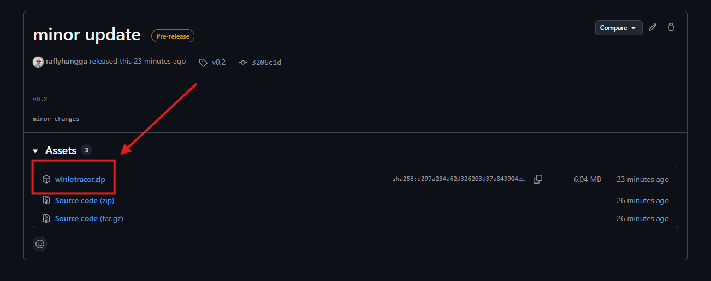
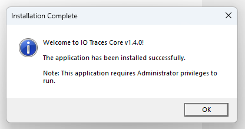
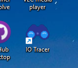
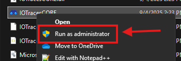
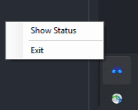
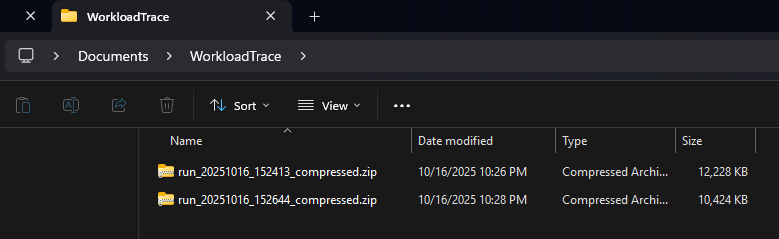
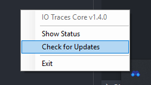

# Quick Start Guide | Windows

## Installation

🎥 Here’s a quick video guide on

- [Tracer installation](https://youtu.be/KIis_5XlYaI)

**Download** the `IOTracer-win-Setup.exe` from [here](https://github.com/cacheMon/io-tracer-win/releases/latest/download/IOTracer-win-Setup.exe) and execute it.  

⚠️ ***IMPORTANT***: It's possible that your system flagged our tool as suspicious software. Bypass it by choosing "keep anyway" option whenever possible.

**Wait** during the installation process  

Until you receive this dialogue.

**Installation complete!**

---

## Basic Usage

### Run the program as administrator

Find the program on your desktop or search bar.

- 
- 

Right–click the application with the **binocular icon** and choose **Run as administrator**.  

### Program starts running 
Once started, you’ll be prompted to several options. 

| Options | Description |
|:---|---|
| Anonymous | if you want to hide some [potentially sensitive data](./privacy.md). |
| Enable Automatic Upload | if you want the trace to automatically upload to our infrastructure. |

If you're comfortable with your choice, hit the run button.

The program is currently active running in the background. You can check its status by right clicking tray icon.

### Exiting the program
Click the exit button from the tray icon

A dialog will pop up telling you to wait while the program doing some cleaning up

Once the dialog closed, the program has gracefully closed.

### Check the output
If you close the program properly, results will be saved inside the `output` path you have set!

---

## Update

The program will **automatically** detect update if there is any.

We allow user to manually check whether is there are any updates available through the tray icon

Updating process will require the tool to restarts. Hence, collection process will be stopped.

---

⚠️ **Important:**  
It's better for us to close the program if you want to shut your device. We'd like to prevent corruption happening during the data collection process 😉.
