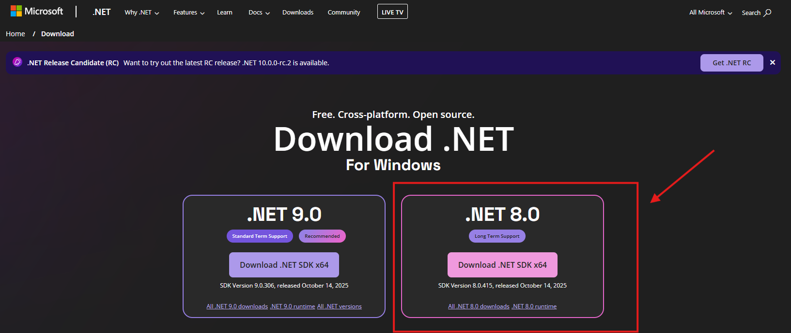
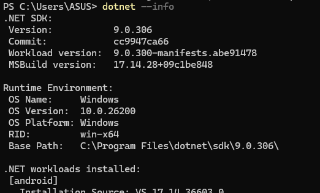

# Quick Start Guide | Windows

## Installation

<!-- In order to use the program, please install the **.NET 8.0** first then the **Tracer** tool. -->

🎥 Here’s a quick video guide on

<!-- - [**.NET 8.0** installation](https://www.youtube.com/watch?v=AlM1odFIQ10) (P.S. Just follow it until the installation completed)  -->
- [Tracer installation](https://youtu.be/17Iba8GJqCA)

<!-- ### .NET 8.0
Install **.NET 8.0** framework from Microsoft's official [download](https://dotnet.microsoft.com/en-us/download) page.

Verify your installation by running `dotnet --info` in the terminal

 -->

<!-- ### Tracer -->
**Download** the `.zip`/`.tar` file from the [GitHub Release page](https://github.com/cacheMon/io-tracer-win/releases) and extract it.  

**Move the extracted folder** to your preferred location.  
We recommend placing it under the **Documents** folder for easy access.  

**Installation complete!**

---

## Basic Usage

### Run the program as administrator  
Right–click the file with the **binocular icon** and choose **Run as administrator**.  

### Program starts running 
Once started, you’ll be prompted to several options. If you're comfortable with your choice, hit the run button.

The program is currently active running in the background. You can check its status by right clicking tray icon.

### Exiting the program
Click the exit button from the tray icon

A dialog will pop up telling you to wait while the program doing some cleaning up

Once the dialog closed, the program has gracefully closed.

### Check the output
If you close the program properly, results will be saved inside the `output` path you have set!

---

⚠️ **Important:**  
It's better for us to close the program if you want to shut your device. We'd like to prevent corruption happening during the data collection process 😉.
