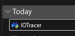
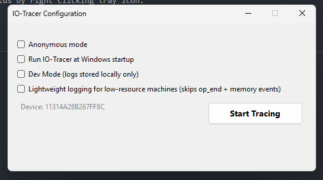
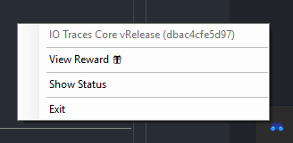
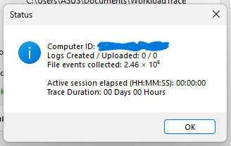

# Quick Start Guide | Windows

## Installation

🎥 Here’s a quick video guide on [(Deprecated) Tracer installation](https://youtu.be/J17jHderD38)

1. **Download** `winiotracer.zip` from [here](https://github.com/cacheMon/io-tracer-win/releases/latest/download/IOTracer.exe).

2. If your browser says the file *"isn't commonly downloaded"* or *"may be dangerous"*, keep it — in the download bar/menu choose ⋯ → **Keep (Edge) or Keep / Keep anyway (Chrome)**.

3. Double-click IOTracer.exe. There's nothing to install or unzip.

4. If "Windows protected your PC" appears, click **More info → Run anyway**.

5. Windows prompts for administrator (ETW kernel tracing needs it) — click Yes.

⚠️ **_IMPORTANT_**: Why the warnings? IOTracer.exe is not code-signed yet, so Windows SmartScreen and browsers flag any unsigned app from an unknown publisher by default. The steps above are safe to dismiss. (Code signing is the permanent fix and can be added later.)

---

## Basic Usage

### Program starts running

Once started, you’ll be prompted to several options.

| Options                      | Description                                                          |
| :--------------------------- | -------------------------------------------------------------------- |
| Anonymous                    | if you want to hide some [potentially sensitive data](./privacy.md). |
| Start on startup             | if you want the program to automatically run every boot              |
| Dev Mode                     | for debugging only and doesn't count as reward.                     |
| Lightweight tracing mode     | for low resource machines.                                           |

If you're comfortable with your choice, hit the run button.

The program is currently active running in the background. You can check its status by right clicking tray icon.

The status displays the Computer ID, Active Session, and File Events Collected.

⚠️ **_IMPORTANT_**: The active session counter only begins when I/O-intensive activity occurs. If the device remains idle, no session time is recorded.

### Exiting the program

Click the **Exit option** from the tray icon. A **dialog will appear** asking you to wait while the program performs cleanup. When the dialog closes, the program has shut down cleanly.

⚠️ **Important:**  
We recommend **exiting the program gracefully** before shutting down to ensure all data is saved correctly.

---

## Uninstall

To uninstall IO-Tracer:

1. **Stop the tracing session** — Right-click the tray icon and click **Exit** to stop the program.

2. **Delete the executable** — Delete the `IOTracer.exe` file that you downloaded.
