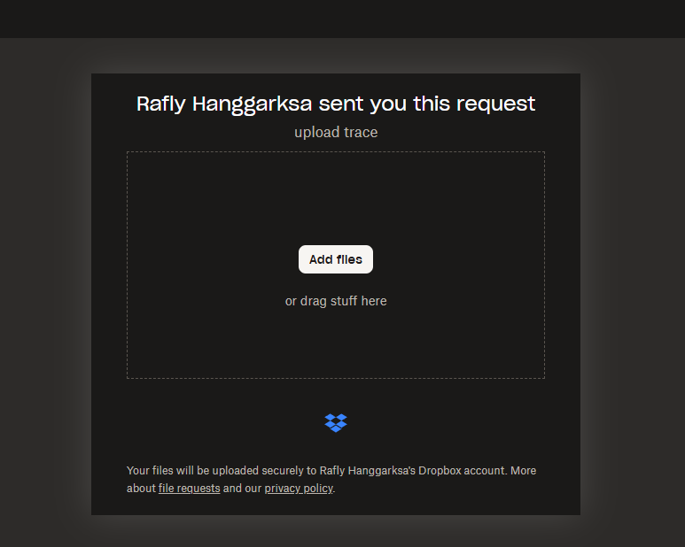

# Upload Guide

This page contains the information about **manual traces uploads procedure**. If you're using automatic upload, you can skip this.

## Trace Output Format

Each time you stop the tracer, the tool saves a set of files.

The files are stored in a folder with this pattern:
```
Windows: 
[output path chosen]\windows_trace\[pc_identifier]\[initial run timestamp]\[trace_output_type]\[trace_file].csv.zst

Linux: 
[output path chosen]/linux_trace/[pc_identifier]/[initial run timestamp]/[trace_output_type]/[trace_file].csv.gz
```

## What to upload?

Open the output path that you have set on your tracer. In my case, I saved it to `Documents\WorkloadTrace`


Please upload the whole `windows_trace` or `linux_trace` folder. **DO NOT** remove anything inside it.

## Where to upload?

Upload the folder here: [https://www.dropbox.com/request/cOJOGlm57Xn70pSC4ltg](https://www.dropbox.com/request/cOJOGlm57Xn70pSC4ltg)

<!--  -->

<!-- You're done! -->